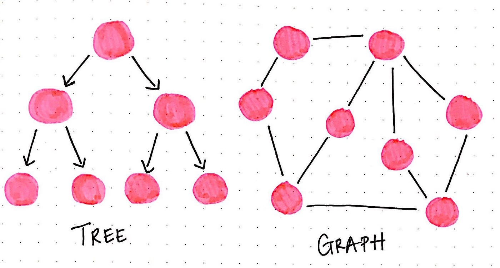

# How We Got Here

##### A brief history of our tech stack.

Part II

---


---

# Goal

To explain out server tech stack.

---

### OSI Layers
---


---

<style scoped>
  h1 {
    background: white;
    padding: 20px;
    border-radius: 50%;
    overflow: hidden;
    font-size: 3em;
    top: -50px;
    right: 200px;
    position: absolute;
    font-family: "Comic Sans MS", "Comic Sans", cursive,sans-serif;
    color: red;
  }
</style>

# REST


---

# But First

---

# REST: REpresentational State Transfer

From https://mannhowie.com/rest-api

* Stateless
* JSON Response
* URL-driven
* Server-driven

---

# REST

From https://mannhowie.com/rest-api

* HTTP Verbs
  - Create: POST
  - Read: GET
  - Update: PUT? PATCH?
  - Remove: DELETE

---

# REST

From https://mannhowie.com/rest-api

* HTTP Status Codes
  - 200 Ok
  - 401 Unauthorized
  - 403 Forbidden
  - 404 Not Found
  - 500 Internal Server Error

---


---


---

<style scoped>
  h1 {
    background: white;
    padding: 20px;
    border-radius: 50%;
    overflow: hidden;
    font-size: 3em;
    top: -50px;
    right: 200px;
    position: absolute;
    font-family: "Comic Sans MS", "Comic Sans", cursive,sans-serif;
    color: red;
  }
</style>

# GraphQL?


---

# GraphQL

* 2015: Release
  - 2 years after react
  - designed to fix the Timeline
* Transport-agnostic (HTTP, WebSockets, TCP?, UDP?)
* Client-driven
* Overfetching
* Underfetching
* Query-driven (`/graphql`)
* JSON Response
* Strict types
* More RPC than REST

---


---



---

# Server Schema

```graphql
type Query {
  # ...
}

type Mutation {
  # ...
}

type Subscription {
  # ...
}
```

---

# Server Schema

```graphql
type Query {
  me: User!
}

type User {
  id: ID!
  adUserGuid: UUID
  firstName: String
  lastName: String
  fullName: String
  supervisor: User
}
```

---

# Client Query

```gql
# runs on your phone
query ON_MOBILE {
  me {
    id
    fullName
  }
}

# runs on your web browser
query ON_WEB {
  me {
    id
    firstName
    lastName
    supervisor {
      id
      firstName
      lastName
    }
  }
}
```

---

# Server Schema

```gql
type Query {
  # ...
  # this is new 
  results(year: Int!): [SurveyResult!]!
}

type User {
  # ...
  # this is new
  results: [SurveyResult!]!
}

type SurveyResult {
  id: UUID!
  userId: ID!
  user: User!
  year: Int!
  successRate: Float!
}
```

---

# Client Query

```gql
# runs on your phone
query ON_MOBILE {
  me {
    id
    fullName
  }
}

# runs on your web browser
query ON_WEB {
  me {
    id
    firstName
    lastName
    # this is new
    results {
      id
      year
      successRate
    }
  }
}
```

---

# Under/Over fetching

```gql
# runs on your phone
query ON_MOBILE {
  me {
    id
    fullName
  }
}

# runs on your web browser
query ON_WEB {
  me {
    id
    firstName
    lastName
    # this is new
    results {
      id
      year
      successRate
    }
  }
}
```
---

# REST?

```http
GET /api/v1/me
GET /api/v1/me/results -> [1, 2, 3]
GET /api/v1/survey-result/1
GET /api/v1/survey-result/2
GET /api/v1/survey-result/3
```

```gql
query MY_RESULTS {
  me {
    id
    firstName
    lastName
    results {
      id
      year
      successRate
    }
  }
}
```
---

# Performance?

* Server
  - Cloud?
  - Geographic distribution
* Client
  - Web
  - Android
  - iPhone
  - Other Servers?

---
# Gateway


---

# Q & A
