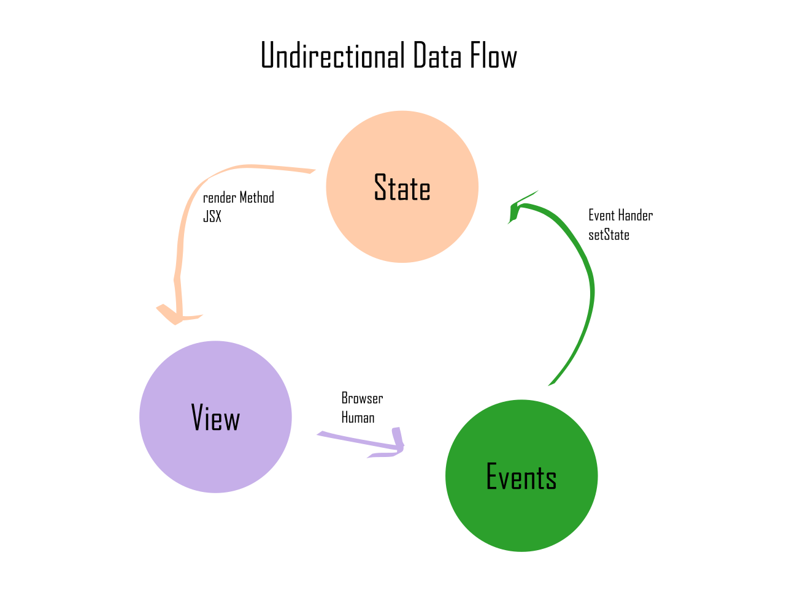
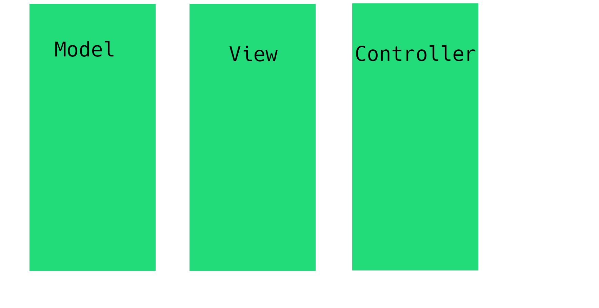
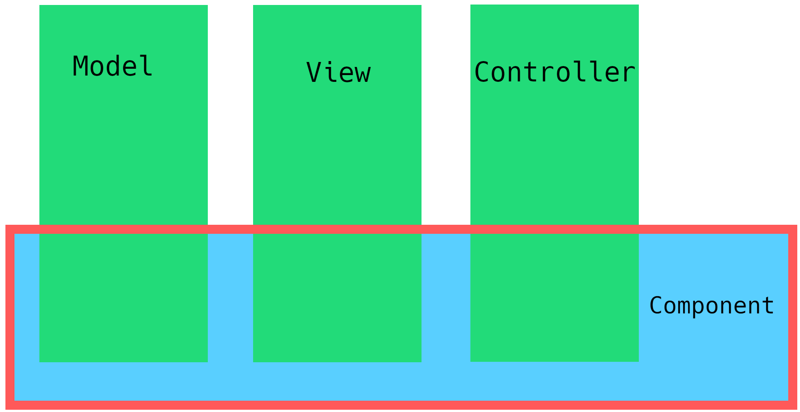

# How We Got Here

##### A brief history of our tech stack.

Part I

---

# React + GraphQL


---


# Goal

To trace the history of the current standard web technologies and show their evolution.

---

# World Wide Web

* Static Documents
* 1989: Static _linked_ documents 
* 1995: JavaScript added to Netscape Navigator (Sun, later Oracle)
* 1995: Internet Explorer with JScript
* Browser Wars
* Late 1996: JavaScript submitted for standardization to ECMA
* 1997: ECMAScript is born

---

# JavaScript

* Used only for small interactivity

* 2006 + 2007: jQquery and MooTools for standard DOM manipulation
* 2010: AngularJS, knockout.js, ember.js
  * 2-way data binding
  * MVC (standard server model)
  * powerful but difficult and messy

---

# facebook

* Started in 2004
* Written in PHP


---


---

# PHP

* Most popular way to build websites
* 2010: XHP
  * Based on ECMAScript for XML (e4x)
    * In firefox 10 (2010) removed in firefox 21 (2013)
    * JSX for PHP
  * Allowed for reusable pieces of UI using `{}` for interpolation

---

# XHP

```php
class :fb:thing extends :x:element {
  protected function render() {
    return <div class="thing">thing {2 + 2}</div>;
  }
}

// usage
<fb:thing />
```
---

# Elm

* 2012
* Evan Czaplicki 
* The Elm Architecture (TEA)
  - Model View Update (MVU)
  - Unidirectional Data Flow


---

# TEA

$$View = f(Model)$$
$$Update = f(Model, Event)$$
$$Model = Update(Model, Event)$$




---

# TEA

$$
View = f(Model)
$$

---

# facebook

* needs more interaction and better performance
  - likes, comments, posts
* 2 competing strategies
  * bolt.js
  * react.js

--- 

# Instagram Web

* React wins when facebook acquired Instagram and writes Instagram.com with React
* 2013: React open source

---

# React

```ts
function Button() {
  return <button type="button">Click Me</button>
}

// usage
<Button />
```

---

# Component Model



---
# Component Model



---


# Component Model
```ts
function TextInput() {
  const [text, setText] = useState('');

  function handleChange(event) {
    setText(event.target.value)
  }

  return <input type="text" value={text} onChange={handleChange} />;
}

// usage
<TextInput />
```
---

# Q & A

---

# How We Got Here

##### A brief history of our tech stack.

Part II

---

### OSI Layers
---


---

<style scoped>
  h1 {
    background: white;
    padding: 20px;
    border-radius: 50%;
    overflow: hidden;
    font-size: 3em;
    top: -50px;
    right: 200px;
    position: absolute;
    font-family: "Comic Sans MS", "Comic Sans", cursive,sans-serif;
    color: red;
  }
</style>

# GraphQL


